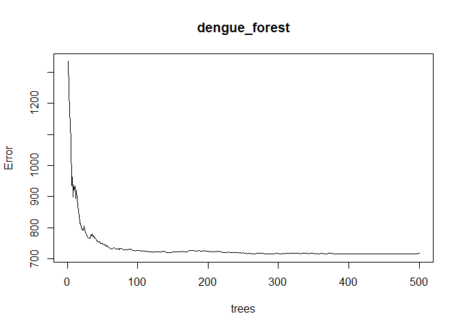
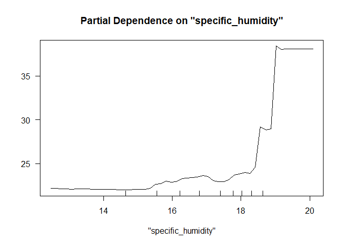

###Probelm Set 3

## What Causes What?

#Question 1: Doing so will not give the causality. Cities with more
crime tend to have more cops. There is this hidden factor (endogenous)
of how often does the city witness crime which also dictates the number
of cops there. If the higher number of cops were in the city due to
reasons unrelated to crime then we could have gotten a causal relation.

#Question 2: Column 1 shows the regression results without controlling
for metro ridership and 2 shows with the control. The first column says
that daily crime rate decreased by 7.3 points on a high alert day when
compared to a non-high alert day and this can be attributed to increased
cops on the streets but this does not hold the riders on metro fixed.
The 2nd column shows that daily crime rate still reduces but by a
marginally lower factor (6 points) on a high alert day when compared to
non-high alert day HOLDING metro ridership constant. Therefore keeping
the number of passengers nearly same, we can say more cops lead to lower
crime rate.

#Question 3: The question arose that whether there were fewer people on
the streets of Washington due to the terrorism alert and therefore the
crime rate has reduced. To control for this, they measured the ridership
on metro and see if there were fewer “victims”. They found that with
people remaining more or less same crime rate has reduced and therefore
eliminating the possibility that the lower crime rate could be because
of lower victims.

#Question 4: This tables shows interaction with one district in one
bucket and all other districts of Washington in another bucket. The
estimation is statistically significant in district 1 but not in other
districts. This just says that we can draw no strong conclusion on the
partial effect of other districts on high alert ON daily crime rate when
controlled for metro ridership. It can be due to insufficient data or
noisy data for other districts that led to insignificant results.

##Tree modeling: dengue cases

Here we use three methods of tree modeling: CART (greedy growing and
pruning), Random Forest and Gradient Boosting. We cross validate on
training data while fitting the trees and then calculate the out of
sample error (RMSE) using the testing data which is out validation
sample in this case.

    ## Distribution not specified, assuming gaussian ...

<table class=" lightable-material-dark" style="font-family: &quot;Source Sans Pro&quot;, helvetica, sans-serif; margin-left: auto; margin-right: auto;">
<thead>
<tr>
<th style="text-align:left;">
</th>
<th style="text-align:right;">
CART
</th>
<th style="text-align:right;">
Random Forest
</th>
<th style="text-align:right;">
Gradient Boosting
</th>
</tr>
</thead>
<tbody>
<tr>
<td style="text-align:left;">
Out of sample error
</td>
<td style="text-align:right;">
32.02
</td>
<td style="text-align:right;">
24.96
</td>
<td style="text-align:right;">
26.28
</td>
</tr>
</tbody>
</table>

The table shows that random forest model gives lowest error and
therefore we would prefer this model over CART and Boosting. Note that
we dont do feature selection here as trees select the important features
optimally. Since by default random forest considers 2/3rd of dataset for
training and rest for testing we dont specify no of folds here.

Below are the compelxity parameter plots for all 3 models:

    ## [1] 41

Since Random Forest is the best model for the above problem we go ahead
with this and plot partial dependence plots:

Since minimum air temperature appears to be a very important feature in
the modeling (second most important) we chose to plot that. There is a
sharp increase in predicted cases at around 297 k.

##Predictive model building: green certification

To test out what would be the best model we try experimenting with a
linear model, K-Nearest neighbours, CART, Random Forest and Gradient
Boosted. We then measure the out of sample accuracy for each of these
models and pick the least inaccurate model for further analysis. First,
we need to do some cleaning activity: • We introduce a variable revenue
= rent\*leasing_rate which is our predictor variable for all the models
used. • We also collapse LEED and Energystar rating into one (green) for
purpose of this analysis. We can keep them separate too if we wish to do
further analysis on different charaterstics of the two ratings. • Lastly
we convert NA or missing value to 0 so that the models can run smoothly.
This model has way too many features and therefore we use stepwise
methodology to determine the optimal set of features. Lasso
regularization can also be used for the same purpose. For this problem
we do forward stepwise simulation. According to stepwise function the
following features and their interactions should be considered: cluster
, size , empl_gr , stories , age , renovated , class_a , class_b ,
green_rating , net , amenities , cd_total_07 , hd_total07 , total_dd_07
, Precipitation , Gas_Costs , Electricity_Costs , City_Market_Rent ,
green Note that we need to do feature selection only for linear model
and KNN. While KNN does require us to specify interactions unlike linear
model, we still have to mention the features to be used. For tree models
this is not required as the tree algorithm chooses optimal features and
uses them more often than the others. It is still an option available
but here we haven’t done that. For CART modelling we stick to 1 SE rule.
All the tree models use cross validation (some by default some have to
be specified). All the cross-validation is done on the training set and
test set is treated as the validation set.

    ## Distribution not specified, assuming gaussian ...

<table class=" lightable-material-dark" style="font-family: &quot;Source Sans Pro&quot;, helvetica, sans-serif; margin-left: auto; margin-right: auto;">
<thead>
<tr>
<th style="text-align:left;">
</th>
<th style="text-align:right;">
Linear Model
</th>
<th style="text-align:right;">
KNN
</th>
<th style="text-align:right;">
CART
</th>
<th style="text-align:right;">
Random Forest
</th>
<th style="text-align:right;">
Gradient Boosting
</th>
</tr>
</thead>
<tbody>
<tr>
<td style="text-align:left;">
Out of sample error
</td>
<td style="text-align:right;">
1068.59
</td>
<td style="text-align:right;">
1313.68
</td>
<td style="text-align:right;">
1122.93
</td>
<td style="text-align:right;">
828.86
</td>
<td style="text-align:right;">
1016.29
</td>
</tr>
</tbody>
</table>

Visibly, random forest is the best amongst all.

 Variable
importance plot gives an interesting story. I want to note an
interesting observation here. When I included property ID variable in
the model (which is nothing but unique identifier of every entry in the
data set I found it to be most useful feature as per the variable
importance plot but this didn’t seem meaningful. This is because
including the unique IDs is similar to regressing the predictor variable
on itself (in language of regression) and it therefore diminishes the
importance of other features disproportionately. To fix for this I
remove this variable in all our models.

    ## [1] 169.7142

On an average rental income from houses that are green certified is
higher than houses that are not certified by nearly $330 per year which
is not a huge difference to an owner who is not bothered about
certification. The variable importance plot also shows that the green
rating is way below in the grid implying it is not a very important
feature while modelling the prediction. Which in other words can be said
that if I were to remove this feature from the model it would cause
least reduction in out of sample error ergo this feature does not have
an important role to play when looking at rental income. This is not
good news for climate fanatics.

Also, since we multiply the two covariates high rent and low leasing and
high leasing an low rent would give the same effect. That effect can’t
be isolated in this model. Looking at some more partial dependence plots
below:

While we see these, we should be mindful that classification features
have no meaning for values between 0 and 1. They can either be 0 or 1.
The partial plots reflect pretty much what we expect – higher age lower
rent, more size increases rent, city market rent is an almost upward
trend. In conclusion, random forest model performs the best and with
least input unlike other tree models. It also very conveniently does not
require feature selection (which most tree models don’t). the only risk
is computational time but otherwise it drastically reduces the time
involved in making the model. Once the model is in place we can move to
next set of interpretations and analysis which requires more time and
manual effort. The other fact that stands out is “greenification” of
houses has a long way to go.

##Predictive model building: California housing

Here we explore 3 different models to come up with the best predictive
model that can give least out of sample error. We use CART model, random
forest and gradient boosting. All cross validation is done on the
training test and the test set is used as the validation set. We are
predicting median market value of all households in California. For this
purpose, we use all the features to begin with and let the trees decide
the important features.

As per out of sample accuracy, random forest trumps to be the best
model.

    ## Distribution not specified, assuming gaussian ...

<table class=" lightable-material-dark" style="font-family: &quot;Source Sans Pro&quot;, helvetica, sans-serif; margin-left: auto; margin-right: auto;">
<thead>
<tr>
<th style="text-align:left;">
</th>
<th style="text-align:right;">
CART
</th>
<th style="text-align:right;">
Random Forest
</th>
<th style="text-align:right;">
Gradient Boosting
</th>
</tr>
</thead>
<tbody>
<tr>
<td style="text-align:left;">
Out of sample error
</td>
<td style="text-align:right;">
59742.46
</td>
<td style="text-align:right;">
50825.14
</td>
<td style="text-align:right;">
51979.2
</td>
</tr>
</tbody>
</table>

We can also take a look at the complexity parameter plots for all 3
models.

    ## [1] 499

Variable importance plot gives an interesting view. Income and house age
seem to very important as expected. Note that longitude and latitude are
more important in prediction than number of bedrooms and rooms. The
longitude and latitude in this case give us an indication of the county
is which the housing is located. Roughly translating to the fact that
market value depends on location.

Below are predictions from the model plotted on California map:

